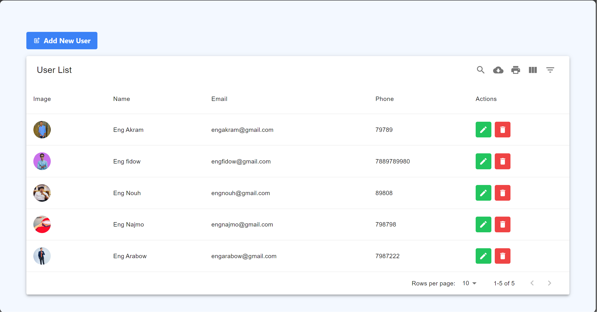

# 🌟 CRUD Operation Project by Eng Fidow 🌟





Welcome to my CRUD Operation project 🚀, a comprehensive solution designed for efficient management and manipulation of data. This project is built using the MERN stack, embodying best practices in creating responsive and scalable web applications.

## Features 📋

- **Create** ➕: Add new entries with detailed attributes including images, ensuring rich data collection.
- **Read** 📖: View all entries in a structured and paginated format, with options for filtering and sorting to easily find specific data.
- **Update** ✏️: Modify existing entries to keep data up-to-date, with support for image changes.
- **Delete** 🗑️: Remove unwanted entries, with confirmation prompts to prevent accidental deletions.

## Getting Started 🚀

To get a local copy up and running follow these simple steps.

### Prerequisites 📝

- Node.js
- MongoDB
- npm

```bash
npm install npm@latest -g

### Copyright 

⭐️ [Copyright 2024 Eng Fidow ](https://www.engfidow.com/)
